# OOO 0x04 — "The Crossing": screen spec

> **What this is:** the build spec for the next version of the site. It's
> written from the owner's design deck *"OOO 0x04 — The Crossing
> (screens)"*: 24 screens, 18 desktop and 6 phone. It's documented here so
> an engineer or an AI can build it without the deck open.
>
> **Sources.** The deck PDF and its HTML bundle are in the repo root,
> untracked and gitignored (13 MB + 6 MB). Every screen is exported in
> [`screens/`](screens/). Measured values (fonts, colours, contrast) come
> from rendering the HTML bundle and reading computed styles. The copy is
> exactly what the deck shows, except where an **owner rule** below
> overrides it.
>
> **Precedence:** the owner's word → the owner rules in §1 → this spec → the
> deck → `OOO-0x04-DESIGN-ROOM.md`. Anything marked **OPEN** needs an owner
> decision before it's built.
>
> Written 2026-09-24 by --claude.

---

## 1. Owner rules that override the deck

These were decided after the deck was drawn. **The deck is wrong on each of
them. Build the rule, not the picture.**

| # | Rule | Deck shows | Build |
|---|---|---|---|
| R1 | The **"Last escape" carousel is photos only**: a selected set, with no text on or under the cards | Card titles, "ON THE PASS", dates, "THE OVERNIGHT BEACH CAMP" | Photo cards only. The section heading ("Last escape" / "Release and Unwind") stays. |
| R2 | 0x03's date is **Aug 15, 2026**. There's no "–16" and no "overnight" anywhere. | "Aug 15–16" (screens 03, 11, 17, 18) and "Overnight" (17, 18) | "Aug 15" / "Aug 15, 2026", with no time or "overnight" chip |
| R3 | **Ticket sales run through one switch**: `src/lib/sales.js` → `SALES_MODE` = `closed` (**now**) → `waitlist` → `open` | The pass and drawer are drawn in the `open` state with 0x03's tiers (Explorer ₦15,000 / Retreat ₦20,000) | Build all three states (see §4.4, §4.10). Ship `closed`. The deck's `open` visuals apply only once real 0x04 tiers exist. |
| R4 | 0x04 is **"November · date TBA"**. The venue, tiers and prices are unknown. | Mostly matches ("[VENUE TBA]") | Never invent a date, venue or price |
| R5 | No invented content presented as real | Placeholder photos, tracks and flyers | Real assets only (see §6). Leave a slot empty rather than fill it with stock. |

---

## 2. Design language (measured from the bundle)

### Type

| Role | Deck font | Where | Note |
|---|---|---|---|
| Display and headings | **Gelasio** (serif, weights 400 / 700) | "Away from the everyday.", every section title, the drawer titles | **OPEN (T1):** the repo self-hosts **Fraunces**, not Gelasio. Either self-host Gelasio (SIL OFL, so it's allowed) or map the headings to Fraunces and accept the look change. Don't add a Google Fonts link (repo rule). |
| Handwritten eyebrow | **Permanent Marker** | "The auto reply", "Memory timeline", "Boarding pass", "Last escape", "Gone to touch grass. Back soon." | Already self-hosted |
| Stamps and badges | **Bungee** | 0x01–0x04 roundels, "OOO 0X04" drawer badge, the 0x04 postmark | Already self-hosted |
| Body and UI | **system-ui** | Everything else | The PDF looks like Ubuntu only because it was rendered on Linux. **OPEN (T2):** keep the system stack, as the deck does, or use the repo's Space Grotesk. |

### Colour

All contrast ratios are WCAG 2.x, measured against the deck's paper
`#f2efe8`.

| Token | Hex | Use | Contrast on paper |
|---|---|---|---|
| paper | `#f2efe8` | Page background | — |
| card | `#f8f7f2` | Pass, drawers, cards | — |
| ink | `#243e3c` | Headings, primary text, header pill | **10.0:1** |
| muted | `#586a67` | Secondary text | **4.98:1** (passes AA; nothing lighter) |
| deep | `#376a65` | Buttons, links, roundels, closing band | 5.36:1 (paper text on deep: **5.8:1**) |
| marker | `#a02f5c` | Permanent Marker eyebrows | **5.98:1** |
| rust | `#94551c` | "62%" stat | 5.11:1 |
| chaos yellow | `#ffc72c` | **Only** the LOS sign, the issued-pass band, and ONLINE-state notes/popups | ink on yellow: 7.36:1 |
| paper text | `#faf8f2` | Text on deep and on the boot screen | — |

Rule: chaos yellow never appears in the calm (AWAY) page except as the LOS
place sign and the issued-pass band. Anywhere else it means ONLINE noise.

### Shared components

- **Header pill** (every page screen): `OUT OF OFFICE` · status dot + `AWAY`
  / `ONLINE` · sound icon · `OOO PASS →`, a filled ink pill. On phone it
  stays on one line (screens 07/08). The v1 header wrapped, so don't
  regress that.
- **Buttons:** filled deep pill for primary ("Get your pass", "Claim …"),
  outlined pill for secondary ("Back to the page", "Reset view", "See full
  trail").
- **Cards:** card colour, 1px hairline, ~14px radius, soft shadow.
- **Polaroid/tape motif** for photos (Community, Postcard): slightly
  rotated, with a paper-tape corner.

---

## 3. Page structure

The home page is one long scroll, with the water behind the hero and the
paper world below it. The deck numbers screens 01–05 as the page's spine
and 10–15 as the sections that sit between them.

**Proposed order** (**OPEN O1**: owner to confirm):

1. Hero on the water (01; phone 07), with "Wander the water" → explore mode (02; phone 08)
2. The auto reply, stats (10)
3. Last escape, the photo carousel (03)
4. Memory timeline (11)
5. The mixtape (12; phone 12b)
6. Community (13)
7. Postcard (14)
8. Schedule & survival FAQ (15)
9. Boarding pass (04)
10. Closing band (05; phone 09)

Other routes and overlays:

| Kind | Screen |
|---|---|
| Route `#/about` | What we are (16) |
| Route `#/trail` | The trail (17; phone 18) |
| Overlay | Pass drawer (19–21) |
| Overlay | Auto-reply generator (22) |
| First visit | Boot sequence (23) |
| Global state | ONLINE rain (06) |

---

## 4. Screens

Each entry covers: purpose → content → behaviour/states → existing code →
content gaps.

### 4.1 · 01 Hero on the water / 07 phone

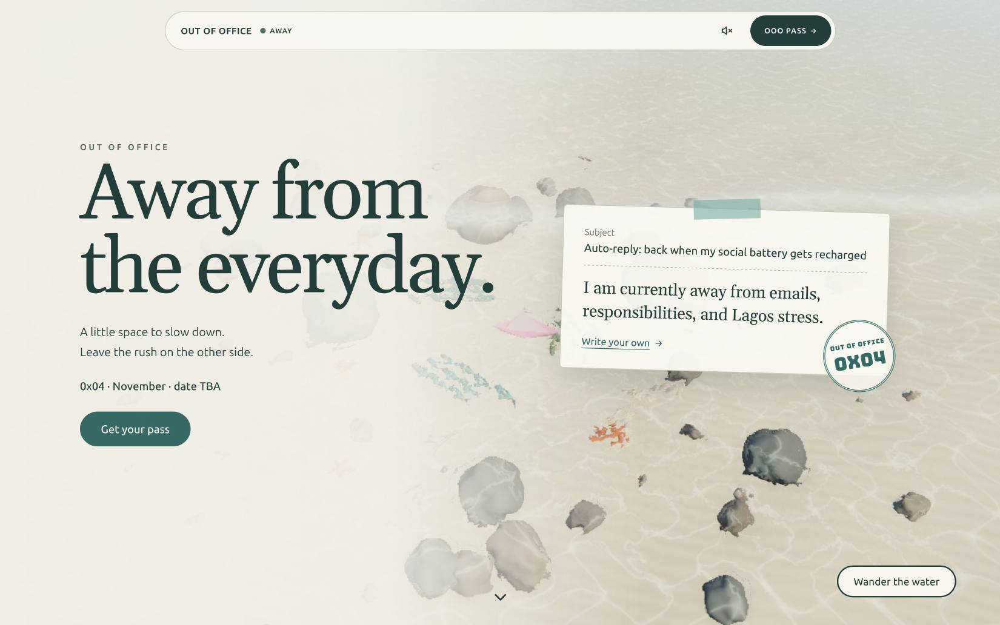

- **Purpose:** you arrive already out of office. The water is the first
  thing you see, and the page is calm.
- **Left column:**
  - Eyebrow `OUT OF OFFICE`
  - H1 **"Away from the everyday."** (Gelasio)
  - "A little space to slow down. Leave the rush on the other side."
  - `0x04 · November · date TBA`
  - Primary **Get your pass**
- **Right, desktop only** (phone omits it, screen 07): the **auto-reply
  email card**. "Subject — Auto-reply: back when my social battery gets
  recharged" / "I am currently away from emails, responsibilities, and
  Lagos stress." / link **"Write your own →"**, which opens the generator
  (22). A teal tape strip sits on top, and a round **OUT OF OFFICE 0x04**
  postmark overlaps its corner.
- **Bottom right:** outlined **Wander the water**. On desktop there's also
  a scroll-cue chevron at bottom centre.
- **Background:** the shallows scene in **`preview` mode**. A paper-coloured
  gradient washes over the left ~45% so the text sits on paper, and the
  water shows through on the right.
- **Behaviour:**
  - In preview mode the canvas does **not** take pointer, touch or wheel
    input. The page scrolls normally everywhere.
  - "Get your pass" follows R3: `closed` opens the "Tickets open soon"
    drawer, `waitlist` opens the waitlist form, `open` scrolls to the pass.
- **Existing code:**
  - `src/lib/Shallows.svelte` plus `src/lib/shallows/createShallows.js`
    already support `initialMode: 'preview' | 'explore'` and return
    `setMode()`.
  - **Build this on that component, not on the current
    `<iframe src="/deepseek_1.html">`.** The iframe runs the raw prototype,
    whose wheel handler calls `preventDefault()` (so desktop scroll is
    trapped over the hero) and shows its demo toolbar. The earlier "No. 03"
    and "The shallows" intro was removed; the embed now opens in preview mode.
  - The hero text must be real HTML, because it's what paints first, and
    the scene fades in behind it.
- **Gaps:** none.

### 4.2 · 02 Exploring the water / 08 phone

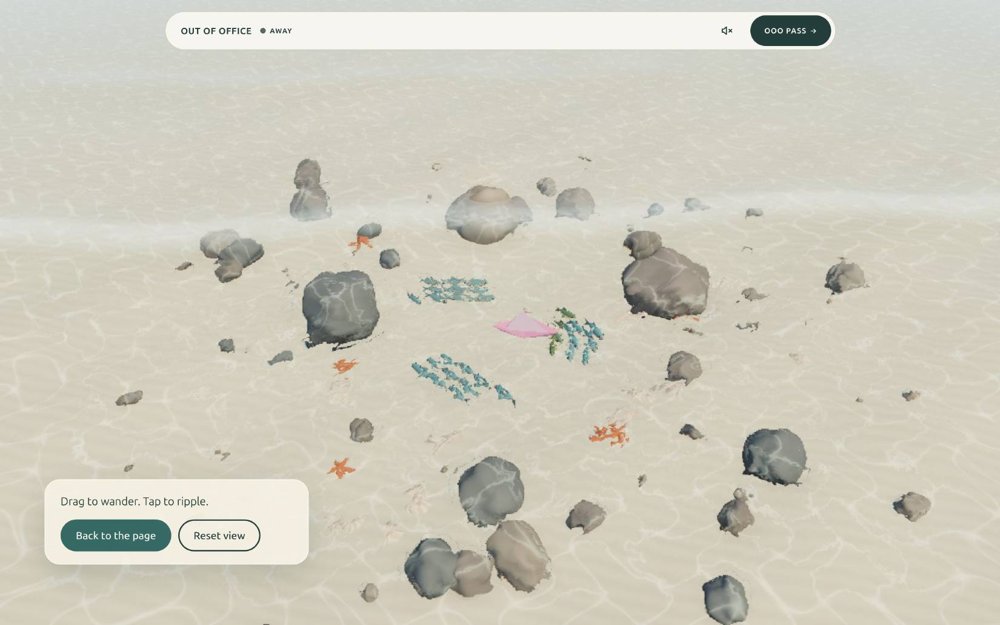

- "Wander the water" → `setMode('explore')`. The hero copy and email card
  fade out, and the canvas takes full-bleed input (drag to orbit, tap to
  ripple, arrow keys).
- The bottom-left card reads "Drag to wander. Tap to ripple." with
  **Back to the page** (primary) → `setMode('preview')` and **Reset view**
  (secondary).
- Esc also returns to the page. Focus moves into the explore card on
  entry, and back to "Wander the water" on exit.
- The page's vertical scroll stays possible while exploring
  (`touch-action: pan-y` on the canvas; no wheel `preventDefault`).
- The easter egg stays: **10 taps on the pink paper boat** open the
  generator. It's already implemented in `createShallows.js`.

### 4.3 · 03 Last escape (0x03): photo carousel

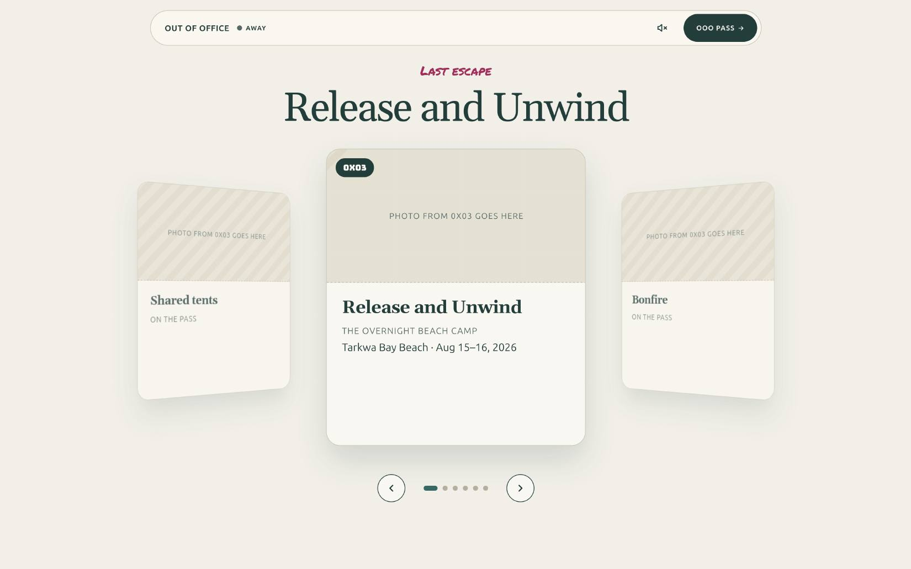

- Marker eyebrow "Last escape", then H2 "Release and Unwind", then a 3D
  ring carousel with prev/next buttons and dots.
- **R1: cards are photos only.** The deck's card text, the "0X03" chip, the
  captions and dates are all dropped.
- **Existing code:** `FeaturedShowcase.svelte` (the 3D ring carousel,
  keyboard arrows, a11y fixes already done). Feed it a photo list; give the
  items no title or meta.
- Each photo needs a real `alt` describing the moment, e.g. "Friends around
  the bonfire at Tarkwa Bay". Alt text isn't on-card text; it's required
  for accessibility.
- **Gap:** the owner's selected 0x03 photos (none are in the repo yet).

### 4.4 · 04 Boarding pass

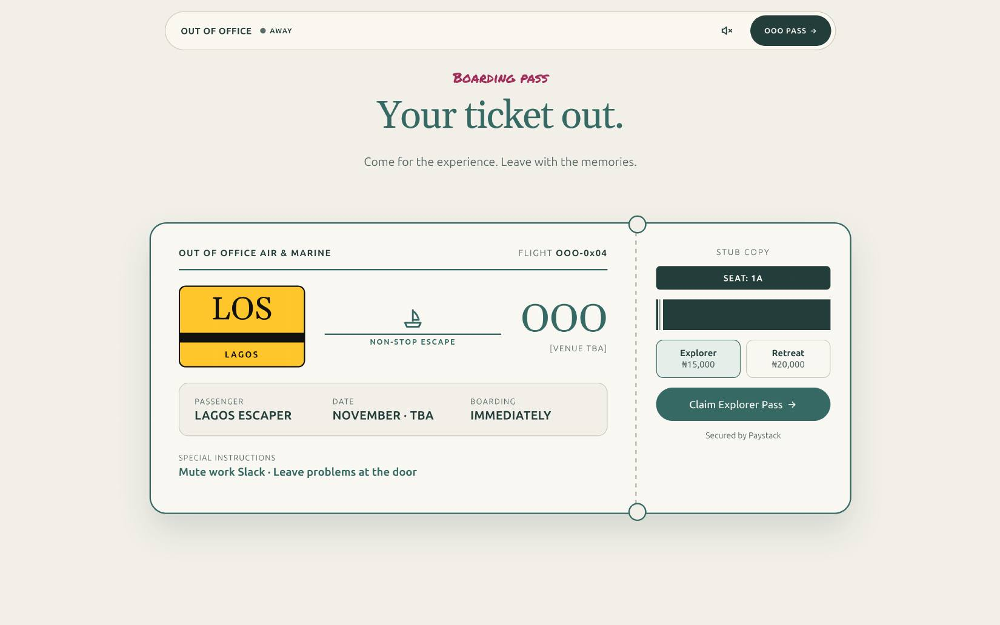

- Marker eyebrow "Boarding pass", then H2 **"Your ticket out."**, then
  "Come for the experience. Leave with the memories."
- **The pass:**
  - Header: "OUT OF OFFICE AIR & MARINE", `FLIGHT OOO-0x04`.
  - Route: a yellow **LOS / LAGOS** place sign → a boat glyph "NON-STOP
    ESCAPE" → **OOO** `[VENUE TBA]`.
  - Detail panel: PASSENGER `LAGOS ESCAPER`, DATE `NOVEMBER · TBA`,
    BOARDING `IMMEDIATELY`.
  - Special instructions: "Mute work Slack · Leave problems at the door".
  - Stub: `STUB COPY`, `SEAT: 1A`, a barcode block, the tier toggle, the
    CTA, and "Secured by Paystack".
- **States (R3):**
  - `closed` (**ship this**): no tier toggle and no prices. The stub says
    "Tickets open soon", "OOO 0x04 · November", and "Tickets aren't on sale
    yet." The CTA opens the closed drawer pane.
  - `waitlist`: the stub holds a name + email form, "Get on the November
    list". **OPEN (P1):** which form service.
  - `open`: the deck as drawn, but with **real 0x04 tiers**, not 0x03's.
- **Existing code:** `Tickets.svelte` (already gated on `SALES_MODE`) and
  `sales.js`. For `open`, reuse `docs/salvage/tickets.kind-noether.js` (the
  tiers in one place, and it fails safely).

### 4.5 · 05 Closing band / 09 phone

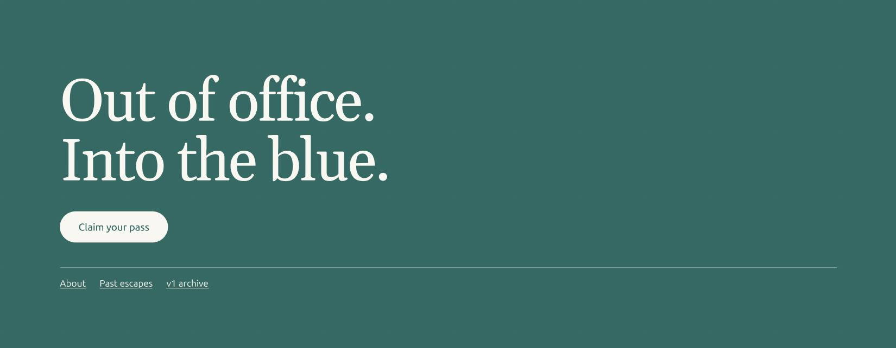

- A full-width deep band: H2 **"Out of office. Into the blue."** (paper
  text, 5.8:1), a light pill **Claim your pass** (follows R3), a hairline
  rule, then links **About** (`#/about`) · **Past escapes** (`#/trail`) ·
  **v1 archive** (`/v1/`).
- This replaces the old `FooterBar` and the "v1 →" link in About (keep that
  one too if you like).

### 4.6 · 06 ONLINE state (the rain)

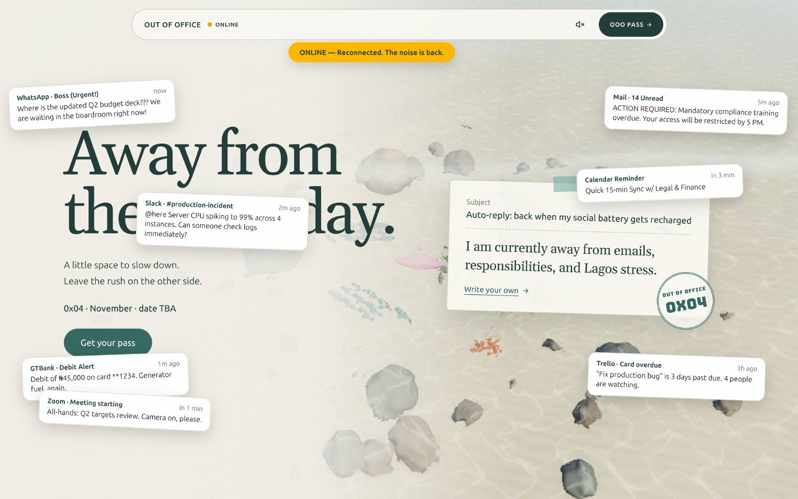

- Header status `ONLINE` with a yellow dot, and a yellow note under the
  header: **"ONLINE — Reconnected. The noise is back."**
- Seven notification cards scatter over the hero:
  - WhatsApp · Boss (Urgent!)
  - Slack · #production-incident
  - GTBank · Debit Alert (₦45,000, "Generator fuel, again.")
  - Zoom · Meeting starting
  - Mail · 14 Unread
  - Calendar Reminder (Quick 15-min Sync)
  - Trello · Card overdue
- **Default state is AWAY.** ONLINE is the opt-in joke.
- **Behaviour** (from the design room, not drawn in the deck):
  - Each card is a button: click, or Enter/Space, bursts it.
  - Toggling back to AWAY bursts them all.
  - After ~8 s the site **auto-mutes itself**: the cards burst, the status
    flips to AWAY, and the note says "Auto-reply re-enabled".
  - Under reduced motion, cards appear and disappear without the fall or
    burst animation.
- **Existing code:** `ChaosLayer.svelte` (card content and the multi-burst
  logic), `HeaderBar.svelte`, and `calm.js`.

### 4.7 · 10 The auto reply (stats)

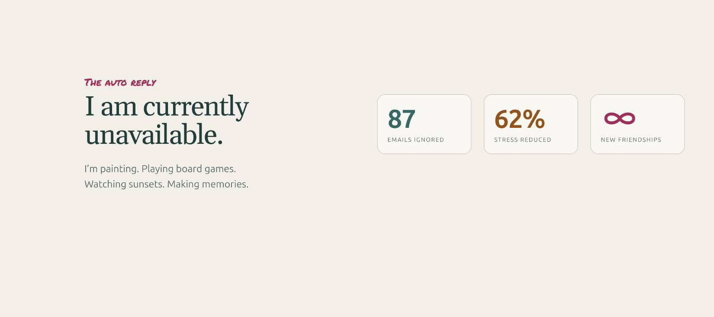

- Marker "The auto reply", then H2 **"I am currently unavailable."**, then
  "I'm painting. Playing board games. Watching sunsets. Making memories."
- Three stat cards: **87** EMAILS IGNORED (deep) · **62%** STRESS REDUCED
  (rust) · **∞** NEW FRIENDSHIPS (marker).
- **OPEN (D8):** these numbers are invented. Keep them only if they read as
  obvious jokes (they sit under "The auto reply", which helps), or replace
  them with real ones.
- **Existing code:** `EscapeMetrics.svelte`.

### 4.8 · 11 Memory timeline

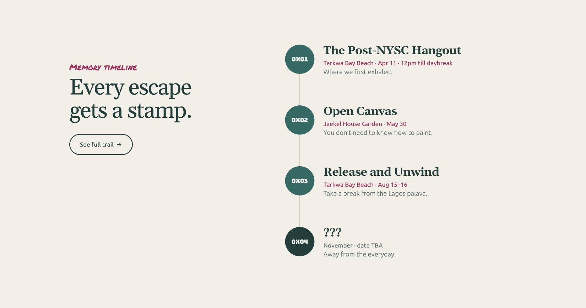

- Left: marker "Memory timeline", H2 **"Every escape gets a stamp."**, and
  an outlined **See full trail →** (`#/trail`).
- Right: a vertical rail of Bungee roundels, each with a title, a meta line
  in marker colour, and a note:
  - **0x01:** The Post-NYSC Hangout · "Tarkwa Bay Beach · Apr 11 · 12pm
    till daybreak" · Where we first exhaled.
  - **0x02:** Open Canvas · "Jaekel House Garden · May 30" · You don't need
    to know how to paint.
  - **0x03:** Release and Unwind · **"Tarkwa Bay Beach · Aug 15"** (R2) ·
    Take a break from the Lagos palava.
  - **0x04:** ??? (darker roundel) · "November · date TBA" · Away from the
    everyday.
- **Existing code:** `MemoryTimeline.svelte`.

### 4.9 · 12 The mixtape / 12b phone

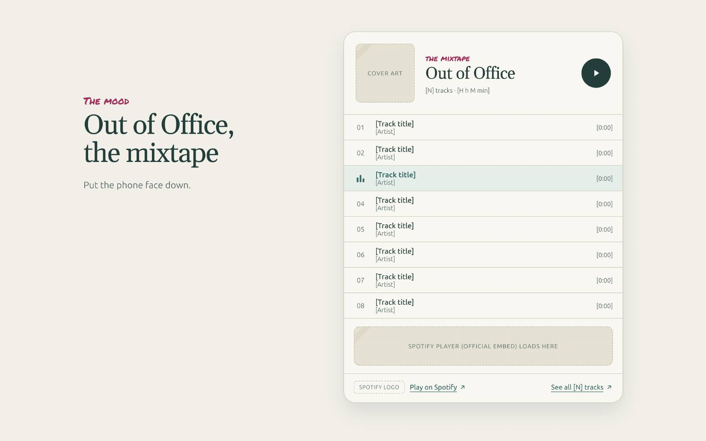

- Left: marker "The mood", H2 **"Out of Office, the mixtape"**, "Put the
  phone face down."
- Right: a custom player card with:
  - cover art, "the mixtape / Out of Office", "[N] tracks · [H h M min]",
    and a play button;
  - 8 track rows (number, title, artist, duration), with the playing row
    highlighted by an equaliser icon;
  - a slot for the **official Spotify embed**;
  - the Spotify logo, "Play on Spotify ↗", and "See all [N] tracks ↗".
- **Gaps:** the playlist URL, cover art and track list. **OPEN (M1):** a
  custom track list needs the track data kept in sync by hand. The simpler,
  always-correct option is the Spotify embed alone.
- **Existing code:** `Playlist.svelte`.

### 4.10 · 13 Community

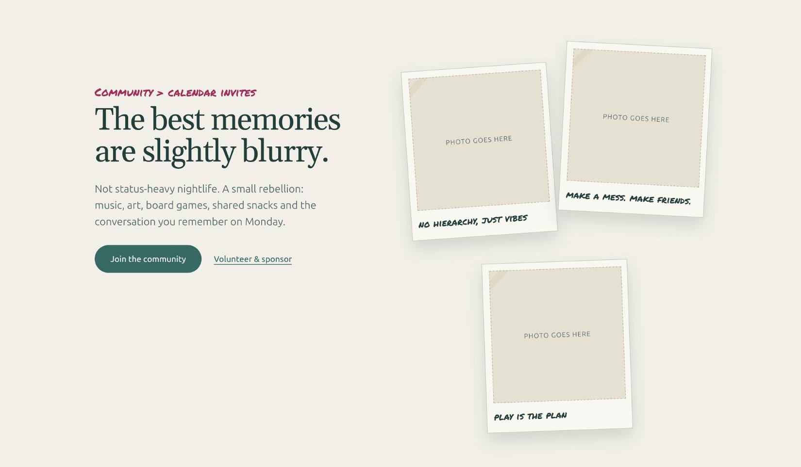

- Marker **"Community > calendar invites"**, then H2 **"The best memories
  are slightly blurry."**, then "Not status-heavy nightlife. A small
  rebellion: music, art, board games, shared snacks and the conversation
  you remember on Monday."
- Buttons: **Join the community** (primary) · **Volunteer & sponsor**
  (text link).
- Three taped polaroids with marker captions:
  - "no hierarchy, just vibes"
  - "make a mess. make friends."
  - "play is the plan"
- **OPEN (C1):** both buttons need **real destinations** (WhatsApp, IG or a
  form). v2 cut "Volunteer & sponsor" because it went nowhere; restore it
  only with a real link.
- **Gaps:** three real community photos. `Community.svelte` currently uses
  Pexels stock, which R5 says must go.

### 4.11 · 14 Postcard

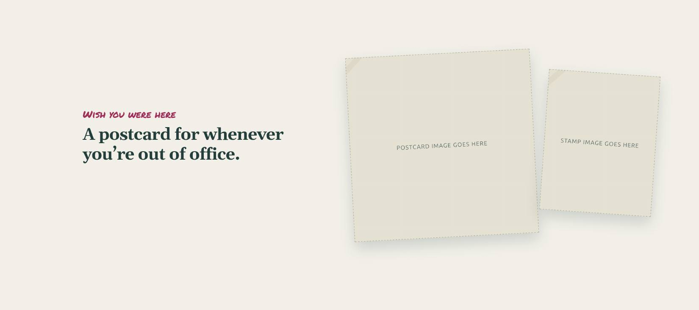

- Marker "Wish you were here", then H2 **"A postcard for whenever you're out
  of office."**, then a large taped postcard image plus a smaller stamp
  image.
- **Assets already exist:**
  `docs/brand-reference/postcard-greetings-from-out-of-office.jpg` and
  `postcard-out-of-office-stamp.jpg`.
- **Existing code:** `Postcard.svelte`.

### 4.12 · 15 Schedule & survival FAQ

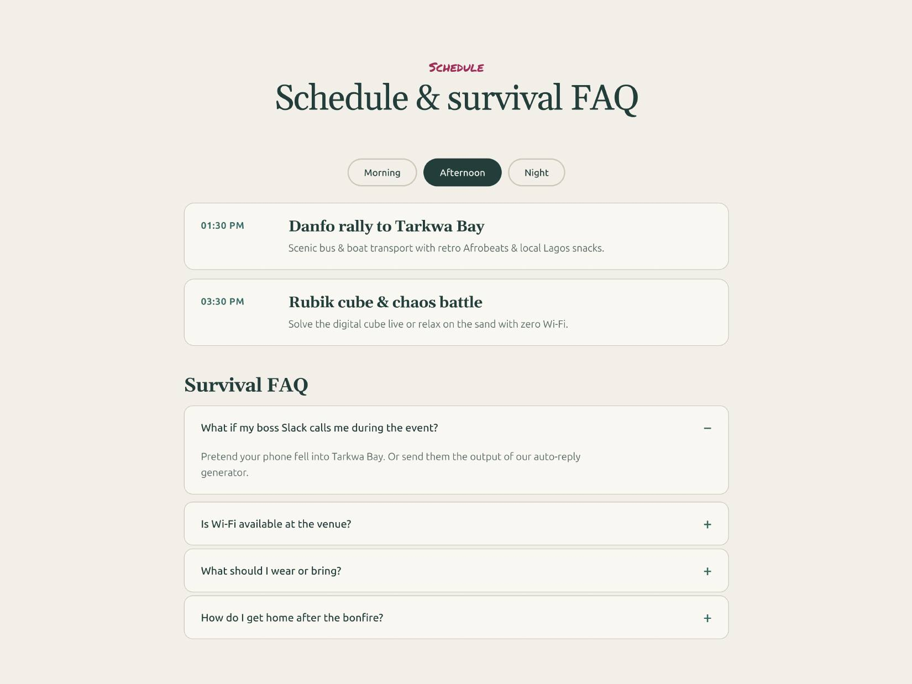

- Marker "Schedule", then H2 **"Schedule & survival FAQ"**.
- Tabs: Morning / Afternoon / Night. Each item is a time plus a titled
  card, e.g. "01:30 PM · Danfo rally to Tarkwa Bay", "03:30 PM · Rubik cube
  & chaos battle".
- Survival FAQ accordion:
  - What if my boss Slack calls me during the event?
  - Is Wi-Fi available at the venue?
  - What should I wear or bring?
  - How do I get home after the bonfire?
- **OPEN (S1):** the schedule shown is 0x03's. 0x04 has no date or venue,
  so either hide the schedule tabs until 0x04's run-of-show exists (keep
  the FAQ), or label it "Last time's schedule".
- **Existing code:** `ScheduleFAQ.svelte`. The tabs need
  `role="tablist"`, and the accordion needs `aria-expanded`.

### 4.13 · 16 What we are (`#/about`)

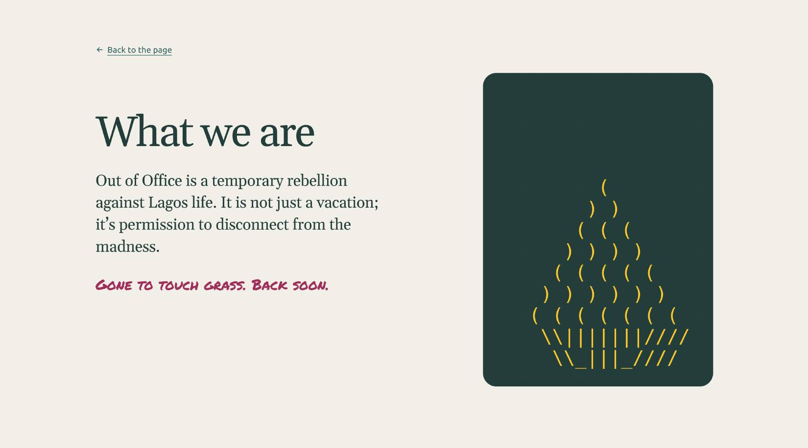

- "← Back to the page", then H1 **"What we are"**, then "Out of Office is a
  temporary rebellion against Lagos life. It is not just a vacation; it's
  permission to disconnect from the madness." Then, in marker, "Gone to
  touch grass. Back soon."
- On the right, a deep-ink rounded panel holding the **ASCII bonfire in
  yellow**.
- This is a change: the old About was a full dark page. Now it's the paper
  page with a dark panel.
- **Existing code:** `AboutEvent.svelte` + `AsciiFire.svelte`. Keep the "v1
  →" archive link, or move it to the closing band (05).

### 4.14 · 17 The trail (`#/trail`) / 18 phone

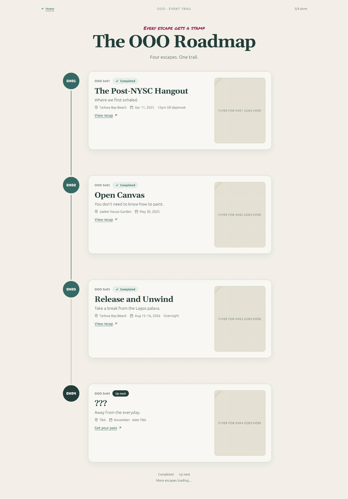

- Top bar: "← Home", "OOO · EVENT TRAIL", "3/4 done". Then marker "Every
  escape gets a stamp", H1 **"The OOO Roadmap"**, and "Four escapes. One
  trail."
- A vertical rail of roundels. Each card has:
  - the stamp and status chip ("Completed ✓" / "Up next");
  - title and tagline;
  - venue, date and time with icons;
  - a link ("View recap ↗" / "Get your pass ↗");
  - a **flyer** on the right. On phone the flyer sits inside the card.
- Cards:
  - **0x01:** Tarkwa Bay Beach · Apr 11, 2025 · 12pm till daybreak.
  - **0x02:** Jaekel House Garden · May 30, 2025.
  - **0x03:** Tarkwa Bay Beach · **Aug 15, 2026** (R2: no "Overnight" chip).
  - **0x04:** ??? · TBA · November · date TBA · **Get your pass** (R3).
- **Assets already exist for 0x01–0x03:**
  - `flyer-post-nysc-hangout-tarkwa-bay.png`
  - `flyer-open-canvas-jaekel-house.png`
  - `flyer-save-the-date-painting.png`
- **Gap:** the 0x04 flyer. Until it exists, show a "Flyer drops soon"
  treatment, not an empty box.
- "View recap" currently goes to `#/about`. **OPEN (TR1):** real recaps, or
  drop the link.
- **Existing code:** `EventTrail.svelte`.

### 4.15 · 19–21 Pass drawer

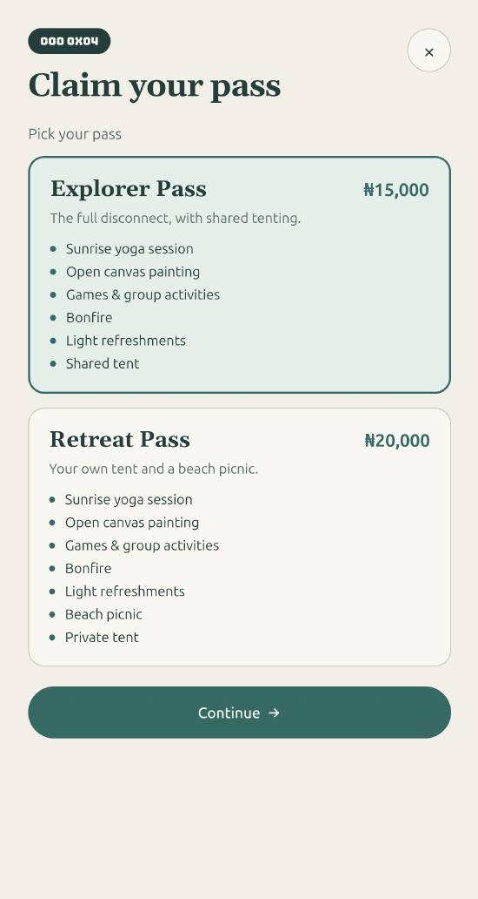

It's a right-hand sheet with an "OOO 0X04" Bungee badge and a × close
button, in three steps:

1. **Pick** (19): "Claim your pass" / "Pick your pass". Two selectable tier
   cards, each with name, price, one-line description and an inclusions
   list. Then **Continue →**.
   - Explorer Pass ₦15,000: "The full disconnect, with shared tenting."
   - Retreat Pass ₦20,000: "Your own tent and a beach picnic."
2. **Details** (20): a summary of the chosen tier, Name or alias
   ("e.g. Tunde (Offline)"), Email ("for your receipt"), Pick a badge
   (Offline Legend …), then **Back** · **Pay ₦15,000**, and "Secured by
   Paystack".
3. **Issued** (21): **"You are in."** A pass with a yellow band: LAGOS OOO
   PASS, OOO-LOS-[CODE], your name, tier, ref, badge, issued date. Then
   **Copy pass data** · **Done**.

- **R3:** the deck draws the `open` flow with **0x03's tiers**. While
  `closed`, the drawer shows only the "Tickets open soon" pane, which
  already exists. In `waitlist`, step 2 becomes name + email with no
  payment. Only `open` uses 19–21, and only with real 0x04 tiers.
- **Must hold:**
  - Inline field errors, not toasts (already built).
  - Payment never starts unless `SALES_MODE === 'open'`. **Restore the
    early-return guard in `handleConfirm`**; the v2 merge dropped it.
  - A pass is only issued on a Paystack success callback. Never add an
    offline or unpaid fallback.
- **Existing code:** `RsvpDrawer.svelte`.

### 4.16 · 22 Auto-reply generator

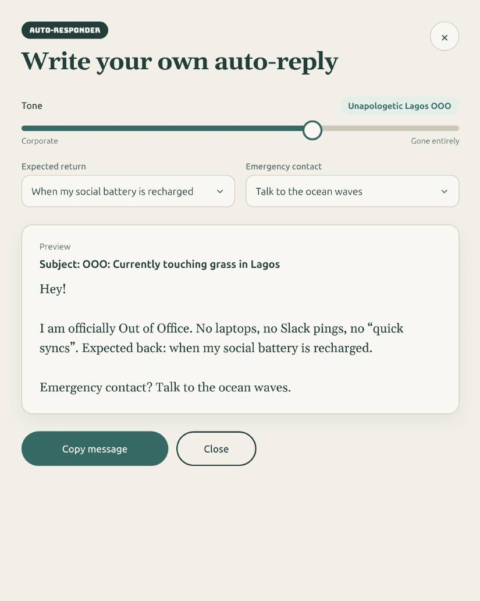

- Badge "AUTO-RESPONDER", then H2 **"Write your own auto-reply"**.
- **Tone** slider: Corporate → Gone entirely, with the current label shown
  (e.g. "Unapologetic Lagos OOO").
- Selects:
  - **Expected return** (e.g. "When my social battery is recharged");
  - **Emergency contact** (e.g. "Talk to the ocean waves").
- A live **Preview** card (subject plus body), then **Copy message**
  (shows "Copied ✓" inline) · **Close**.
- **Entry points:** "Write your own →" on the hero email card (01),
  **the discoverable one**, and 10 taps on the paper boat, the easter egg.
- **Existing code:** `OooGeneratorModal.svelte`.

### 4.17 · 23 Boot sequence

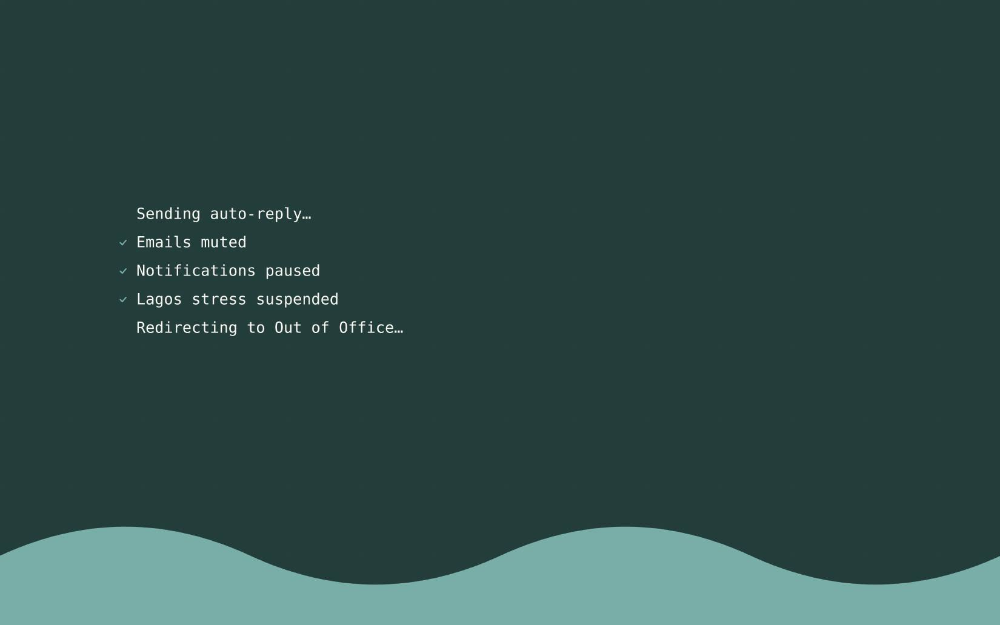

- Deep-ink screen with monospace lines: "Sending auto-reply…", ✓ Emails
  muted, ✓ Notifications paused, ✓ Lagos stress suspended, "Redirecting to
  Out of Office…". A seafoam wave rises from the bottom.
- Plays **once per session** and can be skipped (any key or click).
  Reduced motion shows it statically or skips it.
- **Existing code:** `BootSequence.svelte`. It's not mounted on the current
  `main` layout, so re-mount it.

---

## 5. Non-negotiables (acceptance for every screen)

- **Scrolling is never trapped.** No wheel `preventDefault` outside explore
  mode, and the canvas is `touch-action: pan-y` in explore and
  non-interactive in preview.
- **One WebGL context on the page:** the shallows. Anything else 3D, like
  the cube (the owner keeps `RotatingCube.svelte`, placement **OPEN X1**),
  must not render while the hero water is on screen.
- **Performance:** the hero text renders as HTML before the scene. The
  scene lazy-loads, pauses off-screen (already built), and has a static
  fallback (a gradient or still image) for no-WebGL and reduced motion.
- **Contrast:** use only the §2 tokens. Muted text is never lighter than
  `#586a67`, and chaos yellow is never used for body text on paper.
- **Keyboard:**
  - Every control is reachable with a visible focus ring.
  - Drawers and the generator trap focus and close on Esc.
  - Carousel arrows, and the tabs and accordion, work from the keyboard.
- **Reduced motion is honoured:** no rain fall, no carousel autoplay, no
  boot animation, and the scene paused.
- **Layout:** 390px with no horizontal page scroll. The header pill stays
  on one line.
- **Build:** `npm run build` with zero Svelte warnings. Every commit is
  signed `--<agent>`.
- **Safety:** nothing reaches `main` without owner approval, because `main`
  deploys the live site.

---

## 6. Content and asset checklist

| Item | Needed for | Status |
|---|---|---|
| Selected 0x03 photos (photos only) | 03 carousel | **Owner to supply** |
| 3 community photos | 13 | **Owner to supply** (the current ones are stock) |
| Postcard + stamp images | 14 | ✅ `docs/brand-reference/` |
| Flyers 0x01–0x03 | 17/18 | ✅ `docs/brand-reference/` |
| Flyer 0x04 | 17/18 | Owner, when it exists |
| Spotify playlist URL, cover and track list | 12 | **Owner to supply** |
| Join / Volunteer links | 13 | **Owner to supply** (C1) |
| 0x04 date, venue, tiers and prices | 01, 04, 11, 17, 19–21 | Owner, then flip `SALES_MODE` |
| Waitlist form service | 04, 19–20 (`waitlist`) | **Owner to pick** (P1) |
| 0x04 schedule | 15 | Owner (S1) |

## 7. Open decisions (summary)

- **T1:** Gelasio (self-host) or Fraunces for headings?
- **T2:** system-ui or Space Grotesk for body text?
- **O1:** confirm the page order in §3.
- **X1:** where the cube lives.
- **D8:** the stats' numbers.
- **M1:** custom track list or the Spotify embed alone.
- **C1:** the community links.
- **S1:** the 0x04 schedule.
- **TR1:** trail recaps.
- **P1:** the waitlist form.

--claude
